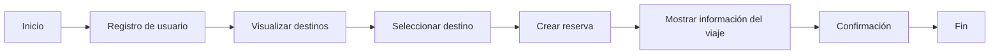
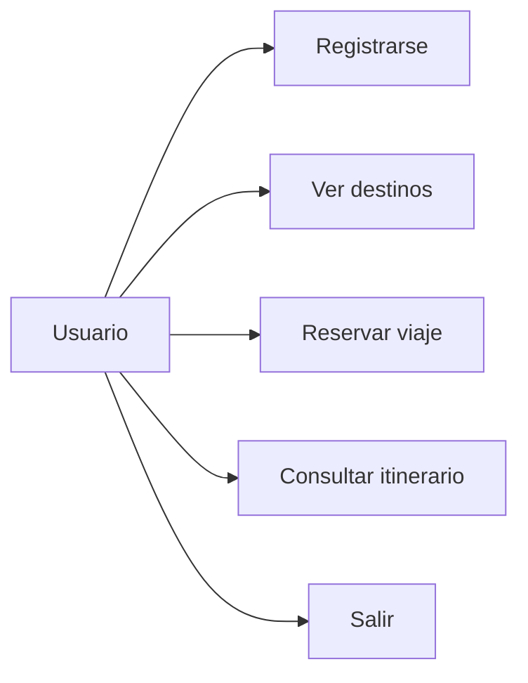
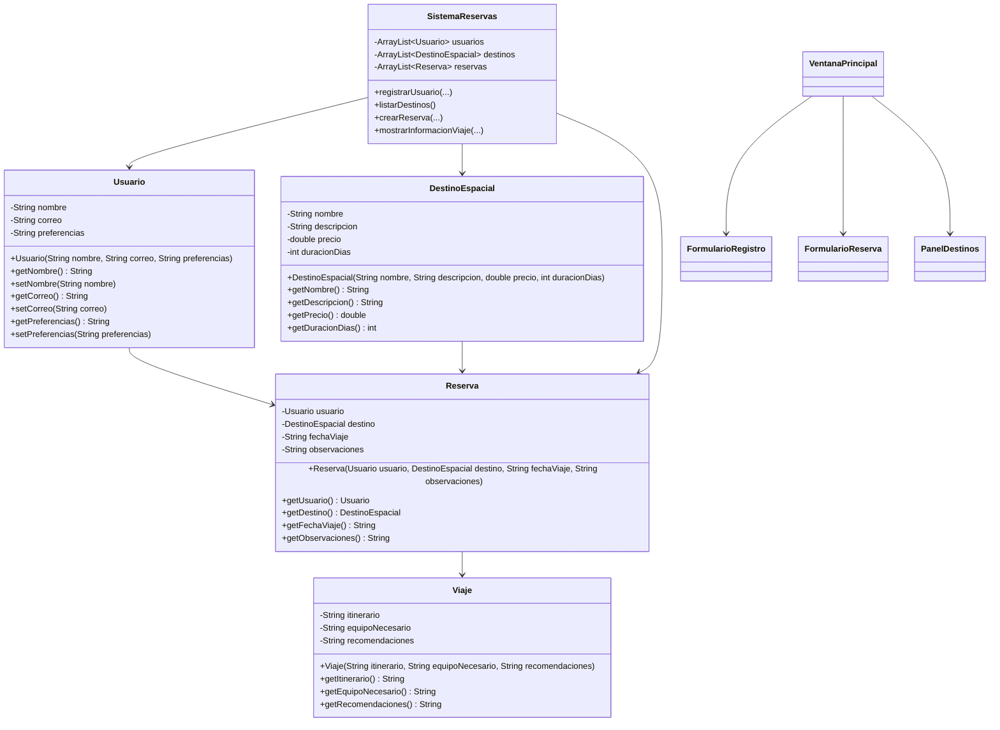
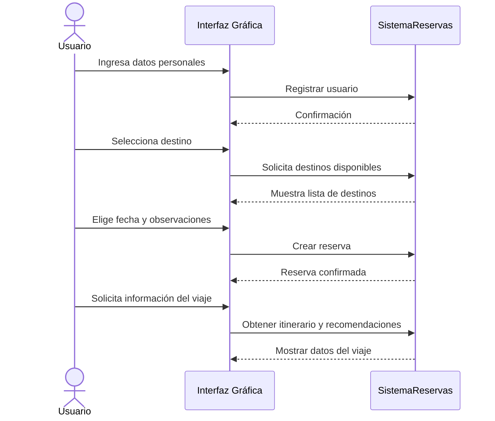

# Sistema de Reservas de Viajes Espaciales

Proyecto final de **Fundamentos de Programación**  
Universidad EAFIT

---

## Descripción

Este proyecto consiste en el desarrollo de un **Sistema de Reservas de Viajes Espaciales** en Java, con interfaz gráfica (**GUI**), que permite a los usuarios registrarse, explorar destinos espaciales, realizar reservas y consultar información detallada del viaje.

El sistema está diseñado para simular una experiencia futurista de reserva de viajes hacia destinos como la Luna, Marte y estaciones espaciales, aplicando conceptos de programación orientada a objetos, estructuras de datos, manejo de excepciones e interfaces gráficas.

---

## Objetivo del proyecto

Crear una aplicación en Java que permita:

- Registrar usuarios.
- Mostrar destinos espaciales disponibles.
- Realizar reservas de viaje.
- Consultar información del itinerario.
- Presentar una interfaz gráfica, intuitiva y fácil de usar.
- Manejar errores mediante excepciones y mensajes claros al usuario.

---

## Funcionalidades principales

- **Registro de usuarios** con nombre, correo electrónico y preferencias.
- **Listado de destinos** como Luna, Marte y estaciones espaciales.
- **Reservas de viaje** con fecha, destino y observaciones.
- **Información del viaje** con itinerario, recomendaciones y equipo requerido.
- **Interfaz GUI** con ventanas, botones, formularios y paneles visuales.
- **Validaciones y excepciones** para evitar datos incorrectos.
- **Persistencia básica** de información, si se implementa.

---

## Requisitos del sistema

### Funcionales

1. El usuario debe poder registrarse.
2. El usuario debe poder iniciar la reserva de un viaje.
3. El sistema debe mostrar destinos disponibles.
4. El sistema debe permitir seleccionar un destino.
5. El sistema debe mostrar detalles del viaje.
6. El sistema debe validar entradas del usuario.
7. El sistema debe informar errores de forma clara.

### No funcionales

- Desarrollado en **Java**.
- Interfaz gráfica con **Swing** o **JavaFX**.
- Código organizado con enfoque **POO**.
- Fácil de usar y mantener.
- Diseño visual futurista.

---

## Tecnologías sugeridas

- **Java**
- **Swing** o **JavaFX**
- **NetBeans / IntelliJ IDEA / Eclipse**
- **GitHub** para control de versiones

---

## Estructura general del programa



---

## Casos de uso



---

## Diseño orientado a objetos

El sistema debe estar organizado usando clases, objetos, constructores, métodos `get` y `set`, e instanciación de objetos.

### Clases sugeridas

- **Usuario**
- **DestinoEspacial**
- **Reserva**
- **Viaje**
- **SistemaReservas**
- **VentanaPrincipal**
- **FormularioRegistro**
- **FormularioReserva**
- **PanelDestinos**

---

## Diagrama de clases



---

## Flujo de reserva



---

## Interfaz gráfica

La aplicación se desarrollará con una interfaz visual que facilite la navegación del usuario. Se recomienda usar:

- Ventana principal con menú.
- Formularios separados para registro y reserva.
- Panel de destinos con tarjetas o listas.
- Botones claros para confirmar, cancelar y volver.
- Colores oscuros y detalles brillantes para un estilo futurista.

### Componentes sugeridos

- `JFrame` para la ventana principal.
- `JPanel` para organizar secciones.
- `JLabel` para mostrar texto.
- `JTextField` para entrada de datos.
- `JButton` para acciones.
- `JComboBox` para seleccionar destinos.
- `JOptionPane` para mensajes y alertas.

---

## Manejo de excepciones

El sistema debe validar entradas para evitar fallos comunes.

### Ejemplos de validación

- Nombre vacío.
- Correo inválido.
- Fecha mal escrita.
- Destino no seleccionado.
- Campos obligatorios sin completar.

### Ejemplo de errores a controlar

- `IllegalArgumentException`
- `NullPointerException`
- Validaciones personalizadas

---

## Estructura de carpetas sugerida

```md
src/
├── modelo/
│   ├── Usuario.java
│   ├── DestinoEspacial.java
│   ├── Reserva.java
│   └── Viaje.java
├── sistema/
│   └── SistemaReservas.java
├── vista/
│   ├── VentanaPrincipal.java
│   ├── FormularioRegistro.java
│   ├── FormularioReserva.java
│   └── PanelDestinos.java
└── Main.java
```

---

## Cómo ejecutar el proyecto

1. Abrir el proyecto en tu IDE.
2. Compilar todas las clases.
3. Ejecutar la clase `Main`.
4. Se abrirá la interfaz gráfica.
5. Registrar un usuario.
6. Seleccionar un destino.
7. Realizar la reserva.
8. Consultar la información del viaje.

---

## Manual de uso

### 1. Registro
El usuario debe ingresar su nombre, correo y preferencias de viaje.

### 2. Selección de destino
El sistema mostrará los destinos disponibles y sus características.

### 3. Reservar viaje
El usuario debe elegir destino, fecha y observaciones adicionales.

### 4. Ver información
El sistema mostrará el itinerario, el equipo necesario y recomendaciones.

### 5. Salir
El usuario puede cerrar el sistema desde la ventana principal.

---

## Capturas o demostración

Se recomienda incluir en este apartado:

- Captura de la ventana principal.
- Captura del formulario de registro.
- Captura del panel de destinos.
- Captura de la confirmación de reserva.
- Video corto demostrando el flujo completo.

---

## Entregables

- Informe técnico.
- Código fuente completo en Java.
- Manual de usuario.
- Capturas de pantalla o video de funcionamiento.

---

## Código de honor y ética

Este proyecto debe cumplir con las normas de integridad académica de la Universidad EAFIT.

### Declaración sugerida

> Declaro que el presente trabajo fue desarrollado por mí, respetando las normas de integridad académica.  
> En caso de haber usado fragmentos de código externo o herramientas de apoyo, estos fueron declarados explícitamente con sus respectivas fuentes.  
> También declaro si utilicé herramientas de inteligencia artificial y de qué manera fueron empleadas.  
> No copié ni mandé a realizar ninguna parte del proyecto como propia.

---

## Recomendaciones para la sustentación

- Explicar la función de cada clase.
- Mostrar cómo se usan los constructores, getters y setters.
- Demostrar cómo se valida la información.
- Explicar el flujo de la GUI.
- Mostrar cómo se crean y guardan las reservas.
- Tener claro el propósito de cada componente visual.

---

## Posibles mejoras futuras

- Guardar datos en archivos o base de datos.
- Añadir login de usuario.
- Agregar más destinos espaciales.
- Calcular precios según clase de viaje.
- Mostrar imágenes o animaciones en la GUI.
- Agregar historial de reservas.

---

## Autores

- Estudiante: **[Tu nombre aquí]**
- Curso: **Fundamentos de Programación**
- Universidad: **EAFIT**

---

## Licencia

Uso académico y educativo.